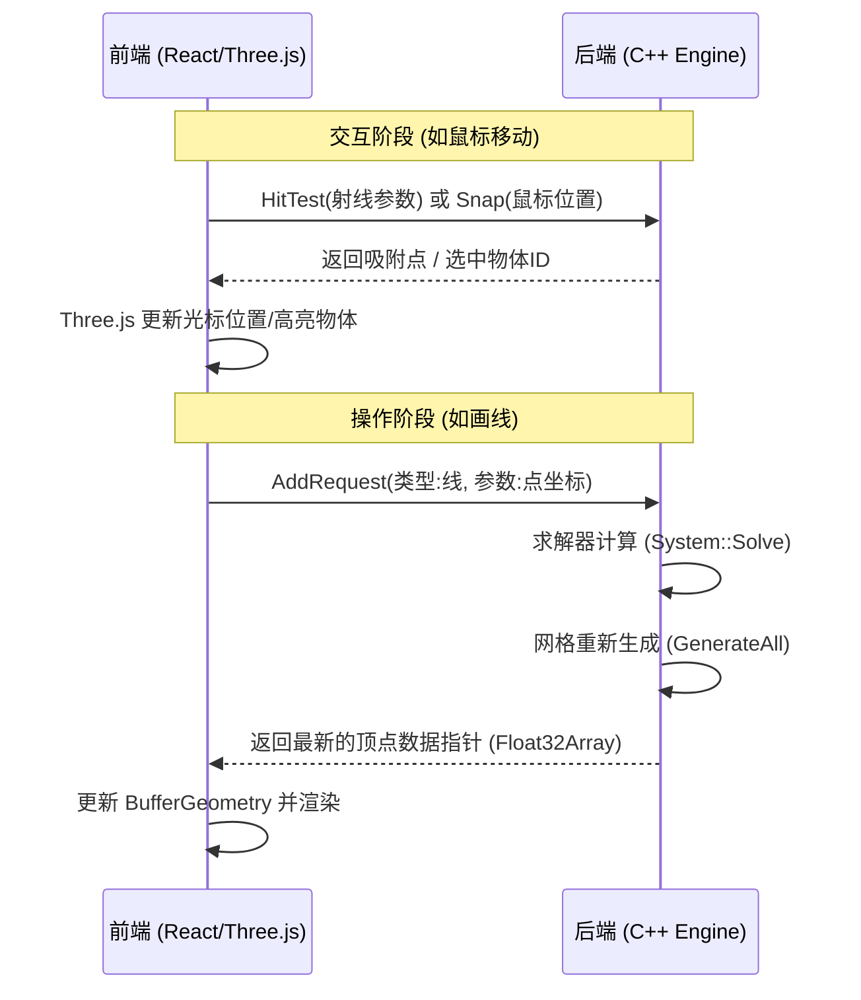

```markdown
# SolveSpace Web：架构分析与现代化重构方案

**版本**：1.0  
**日期**：2023-10  
**主题**：当前 Web 版架构解析、交互流程说明及 Headless + Three.js 重构方案

---

## 1. 当前架构分析 (Current Architecture)

目前的 SolveSpace Web 版本是基于 **Emscripten** 的直接移植（Port）。它保留了 C++ 版本的几乎所有逻辑，包括 UI 绘制和事件处理，仅仅是将 OpenGL 调用翻译成了 WebGL。

### 1.1 核心架构图

```mermaid
graph TD
    subgraph "前端 (Browser Layer)"
        HTML[index.html / Canvas]
        JS[solvespace.js (胶水代码)]
        Input[DOM 事件: 鼠标/键盘]
    end

    subgraph "平台层 (Platform Layer)"
        EM[src/platform/emscripten/emmain.cpp]
        Loop[主循环 (emscripten_set_main_loop)]
    end

    subgraph "核心业务层 (C++ Core)"
        UI[src/window.cpp (窗口管理)]
        Logic[src/mouse.cpp (交互逻辑)]
        Render[src/draw.cpp (OpenGL命令生成)]
    end

    subgraph "数学内核 (Kernel)"
        Solver[src/solver.cpp (几何约束求解)]
        Geo[src/generate.cpp (网格生成)]
    end

    Input -->|触发| JS
    JS -->|调用| EM
    EM -->|分发| Logic
    Logic -->|修改| Solver
    Solver -->|更新| Geo
    Loop -->|驱动| UI
    UI -->|调用| Render
    Render -->|翻译为WebGL| HTML
```

### 1.2 关键代码模块
*   **`src/platform/emscripten/emmain.cpp`**: 程序的入口。负责初始化 WASM，注册主循环，以及将浏览器的鼠标事件转发给 C++。
*   **`src/window.cpp` / `src/draw.cpp`**: 负责“画”出界面。目前的 UI（按钮、工具栏）是 C++ 画出来的，而非 HTML DOM。
*   **`src/mouse.cpp`**: 核心交互逻辑。判断点击的是点、线还是面，以及处理拖拽。

---

## 2. 交互流程详解：以“画矩形”为例

为了理解数据流向，我们将“在画布上点击并画出一个矩形”的操作拆解为以下步骤：

| 步骤 | 动作描述 | 技术栈 | 代码含义/内部逻辑 |
| :--- | :--- | :--- | :--- |
| **1** | **用户点击** | HTML/JS | 浏览器捕获 `mousedown` 事件，获取屏幕坐标 (x, y)。 |
| **2** | **跨语言传话** | Emscripten | JS 将坐标传给 C++ 入口 `emmain.cpp`，胶水代码将 JS 数据结构转为 C++ 数据。 |
| **3** | **意图识别** | C++ Core | `mouse.cpp` 判断当前工具状态为“矩形工具”，记录下第一个点击点的位置。 |
| **4** | **几何求解** | C++ Solver | `solver.cpp` 计算新线段的约束关系（如垂直、水平），并计算精确的空间坐标。 |
| **5** | **生成指令** | C++ OpenGL | `draw.cpp` 生成绘图命令（如“在坐标A到B画一条白线”）。此时还没上屏。 |
| **6** | **渲染上屏** | WebGL | Emscripten 将 C++ 的绘图命令实时翻译成 WebGL 指令，显卡在 `<canvas>` 上绘制出矩形。 |

---

## 3. 现代化重构方案 (To-Be Architecture)

**目标**：实现前后端分离，利用现代 Web 技术栈提升性能与可扩展性。
*   **前端**：Vue/React + Three.js。负责所有 UI、渲染、光照、以及用户的鼠标拾取（Raycasting）。
*   **后端**：C++ (WASM)。作为纯粹的“几何计算引擎 (Headless Engine)”，不再负责渲染和窗口管理。

### 3.1 架构设计流程



### 3.2 核心策略
1.  **交互逻辑剥离**：将 **吸附 (Snapping)** 和 **拾取 (Picking)** 的职责分离。前端负责发出射线，后端负责几何判定。
2.  **数据零拷贝**：利用 WASM 的 Shared Memory 或通过指针直接访问内存，避免在 JS 和 C++ 之间大量拷贝顶点数据。

---

## 4. API 接口契约 (API Interface)

你需要将 C++ 核心封装为一组导出给 JS 调用的无状态或半有状态 API。

### A. 系统管理
*   `Initialize()`: 启动内核内存。
*   `LoadModel(uint8_t* buffer, int length)`: 加载 slvs 文件。
*   `SaveModel()`: 导出二进制流。

### B. 视图与交互 (Interaction Helper)
*   `HitTest(float x, float y, float cameraMatrix[])` -> `int EntityID`: 前端传入坐标和摄像机参数，后端计算选中的实体。
*   `CalculateSnapping(float x, float y)` -> `{x, y, z, type}`: 计算鼠标移动时的自动吸附。

### C. 编辑操作 (Mutations)
*   `AddRequest(int ToolType, Vector3 params)`: 执行画线、画圆等请求。
*   `DragEntity(int EntityID, Vector3 newPos)`: 拖拽点或线。
*   `AddConstraint(int Type, int[] IDs)`: 添加几何约束（垂直、平行等）。

### D. 数据获取 (Rendering Data)
*   `GetMeshVertices(int GroupID)`: **关键**。返回三角面片顶点数据的内存指针（供 Three.js BufferAttribute 使用）。
*   `GetEdgeLines(int GroupID)`: 返回轮廓线数据。

---

## 5. 实施计划 (Roadmap)

### 第一阶段：Headless 核心编译 (2-3周)
*   **任务**：使用预编译宏 `#ifdef HEADLESS` 屏蔽掉所有 GUI 代码 (`window.cpp`, `draw.cpp`)。
*   **产出**：一个纯计算的 `.wasm` 文件，不依赖 Canvas，仅具备加载文件和数学计算能力。

### 第二阶段：静态查看器 (2周)
*   **任务**：实现数据导出接口 `GetMeshVertices`。搭建 Three.js 前端骨架。
*   **产出**：网页可以加载 slvs 文件，并使用 Three.js 渲染出模型（只读）。

### 第三阶段：交互与编辑器核心 (4-6周)
*   **任务**：实现 `HitTest` 和 `DragEntity`。
*   **挑战**：打通“前端鼠标 -> 后端计算 -> 前端重绘”的闭环，保证拖拽流畅度。
*   **产出**：可以在网页上拖拽顶点，模型会实时跟随变形。

### 第四阶段：工具链与约束系统 (持续迭代)
*   **任务**：将左侧工具栏逻辑用 JS 重写，调用后端的 `AddConstraint` 等接口。
*   **产出**：完整的云端 CAD 编辑器。

---

## 6. 风险评估

1.  **性能瓶颈**：复杂模型的实时三角化（Triangulation）可能导致主线程阻塞。
    *   *缓解*：在拖拽过程中只显示线框（Wireframe），鼠标松开后再计算 Mesh。
2.  **内存泄漏**：JS 无法自动垃圾回收 C++ 的堆内存。
    *   *缓解*：建立严格的内存生命周期管理，在模型重载时显式释放旧的 Mesh Buffer。
```